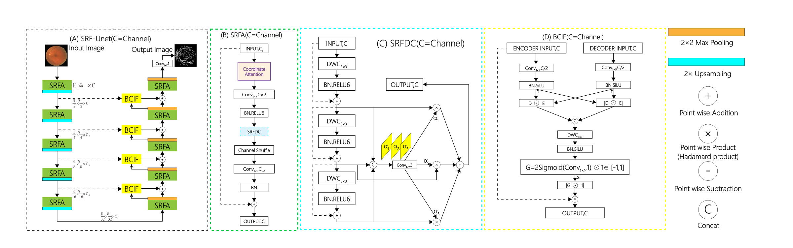
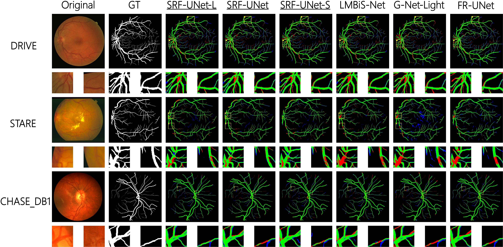

# SRF-UNet

Official PyTorch implementation of **SRF-UNet: A Lightweight Retinal Vessel
Segmentation Network Based on Serial Residual Fusion and Bipolar Interaction**.

**Wang ZiYuan** and **Zhang Lei**  
College of Software, Henan Normal University, China


Contact:
[wangziyuan128@163.com](mailto:wangziyuan128@163.com)

## Overview

SRF-UNet is a compact five-stage encoder-decoder designed for retinal vessel
segmentation. The network combines three components:

- **SRFDC** progressively builds multi-scale context with serial residual
  depthwise convolutions and pixel-adaptive stage fusion.
- **SRFA** combines direction-aware attention, SRFDC, channel shuffling, and a
  residual mapping in a lightweight feature block.
- **BCIF** uses encoder-decoder agreement and discrepancy to generate a bipolar
  gate for selective skip-feature fusion.

The repository provides one unified implementation with three width presets,
plus standalone training and testing entry points. All presets use the same
modules, data pipeline, and forward path.

## Architecture



## Model Variants

| Variant | Channels | Parameters | FLOPs at 224 x 224 |
|---|---|---:|---:|
| SRF-UNet-S | `[8, 16, 32, 48, 80]` | 0.10 M | 0.10 G |
| SRF-UNet | `[16, 32, 64, 96, 160]` | 0.34 M | 0.26 G |
| SRF-UNet-L | `[32, 64, 128, 192, 320]` | 1.22 M | 0.79 G |

The default model is the base SRF-UNet with three serial SRFDC stages.

## Qualitative Results

Green, blue, and red pixels represent true positives, false positives, and
false negatives, respectively.



## Installation

Python 3.9 or later is recommended.

```bash
git clone <repository-url>
cd SRF-Unet

python -m venv .venv
```

Activate the environment:

```bash
# Linux or macOS
source .venv/bin/activate

# Windows PowerShell
.venv\Scripts\Activate.ps1
```

Install PyTorch for the CUDA version available on your system, or install the
default package from PyPI:

```bash
python -m pip install --upgrade pip
pip install -r requirements.txt
```

The pinned package versions in `requirements.txt` reproduce the environment
used for this release.

## Usage

```python
import torch

from srf_unet import create_model


model = create_model(size="base", num_classes=1, in_channels=3)
model.eval()

image = torch.randn(1, 3, 224, 224)
with torch.no_grad():
    logits = model(image)[0]
    probability = torch.sigmoid(logits)

print(probability.shape)
# torch.Size([1, 1, 224, 224])
```

Select another width preset:

```python
from srf_unet import srf_unet_s, srf_unet, srf_unet_l


small_model = srf_unet_s()
base_model = srf_unet()
large_model = srf_unet_l()
```

Custom channel widths are also supported:

```python
from srf_unet import SRFUNet


model = SRFUNet(
    size="base",
    channels=(12, 24, 48, 72, 120),
    series_stages=3,
)
```

The forward method returns a one-element list containing raw segmentation
logits. Apply `torch.sigmoid` for binary probabilities or an appropriate
activation for a multi-class task.

## Dataset Layout

The training and testing scripts expect the following directory structure:

```text
data/
`-- DRIVE/
    |-- train/
    |   |-- image/
    |   `-- mask/
    `-- test/
        |-- image/
        `-- mask/
```

The same layout can be used for another retinal vessel dataset by changing the
`--dataset` argument. Common `images/masks` directory names are also detected.

## Training

Train the base model:

```bash
python train_srf_unet.py \
  --data_root ./data \
  --dataset DRIVE \
  --model_size base \
  --epochs 200 \
  --runs 3 \
  --batch_size 16 \
  --patch_size 224 \
  --train_stride 112 \
  --infer_stride 112
```

Use `--model_size s` or `--model_size l` to train the small or large preset.
Checkpoints, configuration metadata, and the training history are written to
`outputs/<run_id>/`.

The released training objective is the region-aware structure loss. clDice is
reported as an evaluation metric and is not used for backpropagation.

## Testing

Evaluate a saved checkpoint:

```bash
python test_srf_unet.py \
  --checkpoint ./outputs/<run_id>/best.pth \
  --data_root ./data \
  --dataset DRIVE \
  --split test \
  --patch_size 224 \
  --infer_stride 112
```

Testing preserves the original image resolution and blends overlapping
probability patches with Gaussian weights. Per-image metrics, an average
summary, and binary prediction masks are saved under `test_results/`.

## Repository Structure

```text
SRF-Unet/
|-- assets/
|   |-- qualitative_results.jpg
|   |-- srf_unet_architecture.png
|   `-- srf_unet_architecture.svg
|-- LICENSE
|-- README.md
|-- requirements.txt
|-- srf_unet_data.py
|-- test_srf_unet.py
|-- train_srf_unet.py
`-- srf_unet.py
```

## License

This project is released under the BSD 3-Clause License. See [LICENSE](LICENSE)
for details.
